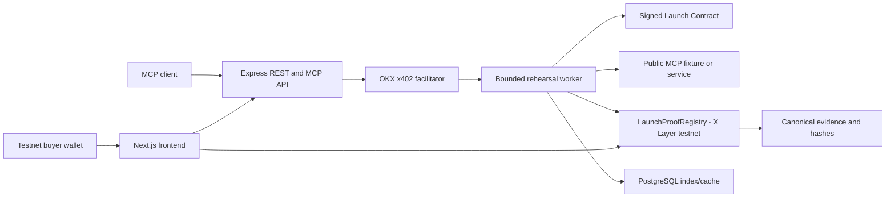

# LaunchProof

[](https://github.com/Kevincruz2005/LaunchProof/actions/workflows/ci.yml)

LaunchProof performs a bounded MCP service rehearsal, settles the configured OKX x402 test payments, and publishes canonical evidence to an immutable registry on X Layer testnet. The result is a Service Passport whose evidence, manifest, input, normalized-result, payment-receipt, and source-revision hashes can be recomputed independently.

This repository is testnet-first and fail-closed:

- The supported public profile is X Layer testnet `eip155:1952` with the official test USD₮0 contract.
- RPCs, token, registry, deployment block, deployed runtime-code hash, writer, fixture URLs, and provider identities come from validated environment configuration.
- A Passport is `verified` only when all five gates pass, including real paid delivery.
- Unpaid or private executions record `execution_mode=local` and local payment status; the provenance label remains `fixture` or `external`, and such runs cannot be presented as verified public evidence.
- The repository contains no deployer, registry-writer, payer, payout, fixture, facilitator, or tunnel credential.

The official OKX documentation lists X Layer testnet and test USD₮0 support in its [x402 seller SDK](https://web3.okx.com/onchainos/dev-docs/payments/service-seller-sdk) and [buyer integration](https://web3.okx.com/onchainos/dev-docs/payments/payment-use-buyer) guides.

## Start here

Read the [complete project and implementation guide](./docs/PROJECT_IMPLEMENTATION.md) for the architecture, trust model, payment/evidence design, recovery behavior, verification model, test results, and current deployment readiness. Follow [setup.md](./setup.md) from a clean clone for the command-by-command operator runbook. It covers fresh key generation, testnet funding, registry deployment, read-only deployment verification, four explicitly configured fixtures, x402 setup, PostgreSQL, application startup, and end-to-end verification.

```bash
git clone https://github.com/Kevincruz2005/LaunchProof.git
cd LaunchProof
corepack enable
corepack prepare pnpm@10.13.1 --activate
pnpm install --frozen-lockfile
cp .env.example .env
```

Do not reuse any key or OKX credential that has appeared in source control, logs, chat, screenshots, or a demo recording. `pnpm keys:testnet` creates unique local secrets in ignored mode-0600 files and prints only public addresses.

## Architecture



The frontend and backend build separately and share the versioned files in [`schema/`](./schema). The four services in [`fixtures/`](./fixtures) are controlled, signed fixtures with distinct keys and explicit URLs; they are never inferred from a shared base domain.

## What a run proves

1. The worker fetches a public `/.well-known/launch-contract.json`, validates it against the active chain policy, and verifies its EIP-191 declaration.
2. It performs MCP initialization and discovery without charging those discovery messages.
3. It executes a fixed sample, a bounded invalid input, and exactly three fresh synthetic challenges.
4. It checks output values, required fields, latency, and safe structured-error behavior.
5. When paid delivery is declared, the target payer settles the exact allowlisted test USD₮0 terms once and verifies the successful receipt.
6. It canonicalizes retained evidence with RFC 8785/JCS, computes the hashes, and publishes them through the configured registry writer.
7. Reads and verification use the registry event/storage as authority; PostgreSQL is only an index and cache.

The five gates are `discoverable`, `contract_correct`, `fresh_challenge`, `safe_to_rehearse`, and `paid_delivery`. Their only states are `pass`, `fail`, and `not_tested`. `verified` means every gate is `pass`.

## Fixture modes

```bash
pnpm fixtures:build

# Deterministic local URLs, intended for integration/development only.
pnpm fixtures:local

# Four separate public HTTPS URLs. Public modes require a clean Git worktree.
bash scripts/start-fixtures-ngrok.sh
bash scripts/start-fixtures-localtunnel.sh
```

Each script writes the four exact URLs and corresponding public provider addresses to ignored `.env`. Public startup derives `SOURCE_REVISION` from the clean committed `HEAD`; it refuses to sign public fixture claims from uncommitted code.

## Independent verification

For a completed paid testnet run:

```bash
curl "$PUBLIC_API_BASE_URL/runs/$RUN_ID" | jq .
curl "$PUBLIC_API_BASE_URL/verify/$RUN_ID" | jq .
./scripts/verify-run.sh "$RUN_ID"
```

`verify-run.sh` requires both x402 settlements, all five passing gates, `execution_mode=testnet`, a valid provenance label, a published registry transaction, and recomputed chain/hash/signature matches.

## Honest boundary

LaunchProof is a single-writer, onchain attestation registry—not a decentralized oracle or security certification. The registry makes evidence immutable and independently hash-verifiable; it cannot itself observe HTTPS/MCP execution. Network execution, latency measurement, and field comparisons happen in the backend and are attested by LaunchProof, plus the provider declaration when supplied.

Controlled fixtures must be identified as LaunchProof fixtures. Testnet tokens have no monetary value, and a testnet Passport is not a mainnet settlement, marketplace identity check, or OKX endorsement.

MIT licensed. See [`LICENSE`](./LICENSE).
