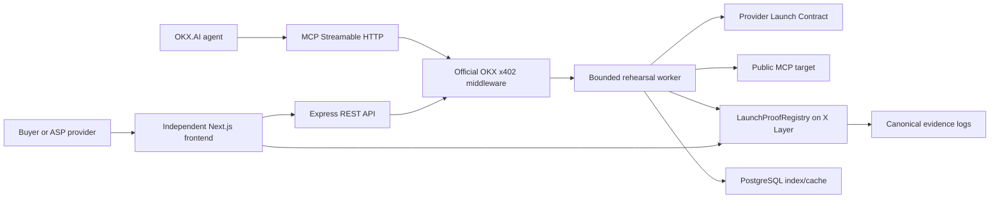

# LaunchProof

[](https://github.com/your-org/launchproof/actions/workflows/ci.yml)

> **Problem:** a marketplace cannot route paid agent work confidently when listed tools silently fail, drift from their declared schema, or return unusable output.  
> **User:** an ASP builder before listing, and an agent buyer deciding whether to call a paid service.  
> **Product:** LaunchProof performs a bounded, paid MCP rehearsal and returns a shareable Service Passport with reproducible evidence.  
> **What is implemented now:** public MCP discovery, contract checks, valid/invalid synthetic calls, timeout handling, evidence publication, and official x402 payment paths; real mainnet proof remains pending deployment credentials.  
> **Why OKX.AI:** A2MCP turns the quality check into a billable agent service; the Passport improves confidence in services buyers discover and pay for on the marketplace.  
> **How to verify:** visit the project card, call the documented fixture, inspect `/runs/{runId}`, and verify the evidence directly against X Layer.

LaunchProof rehearses an agent service's advertised paid task and gives buyers a versioned Service Passport before they pay for the real job. The implementation is ready for deployment, but this repository intentionally contains no fabricated mainnet address, payment, listing, or Passport. Fill the production values below only after their corresponding transactions and deployments exist.

| Public fact | Value |
|---|---|
| API | Not deployed yet |
| Web app | Not deployed yet |
| Genesis Launch Rehearsal | `0.01 USDT0` through a fixed OKX x402 route |
| Renew Passport | `0.10 USDT0` through a separate fixed OKX x402 route |
| X Layer registry | Not deployed yet |
| Deployed source commit | Not deployed yet |
| Network | X Layer mainnet, `eip155:196` |

## 60-second verification

After the production values are configured:

```bash
curl "$PUBLIC_API_BASE_URL/.well-known/launchproof.json"
curl "$PUBLIC_API_BASE_URL/runs/$RUN_ID"
curl "$PUBLIC_API_BASE_URL/verify/$RUN_ID"
./scripts/verify-run.sh "$RUN_ID"
```

The verification endpoint reads the registry and `RunPublished` log from X Layer, recomputes the manifest, input, normalized-result, and evidence hashes, then reports a database-cache mismatch separately. The cache cannot make chain verification pass.

## Architecture



The frontend and backend never import one another. They build and deploy separately and share only the versioned files in [`schema/`](./schema). Four fixtures are separately deployable services under [`fixtures/`](./fixtures).

## What a run does

1. Fetch and validate a provider's public HTTPS `/.well-known/launch-contract.json` with DNS pinning and redirect revalidation.
2. Verify an optional EIP-191 declaration over the RFC 8785 canonical manifest hash.
3. Perform MCP initialize and tools/list, then check the declared tool and relevant input fields.
4. Execute one fixed sample and one controlled invalid input with no target retry.
5. Generate and execute exactly three distinct `structured-extraction-v1` invoices.
6. If signed x402 terms are advertised, enforce the X Layer/USDT0/amount/recipient/resource allowlist and wallet budgets before paying once.
7. Canonicalize retained evidence, remove transient raw bodies, and publish the evidence and critical hashes to the registry.
8. Expose the same canonical run as an agent-readable result and buyer-readable Passport.

The five gates are `discoverable`, `contract_correct`, `fresh_challenge`, `safe_to_rehearse`, and `paid_delivery`. They use only `pass`, `fail`, or `not_tested`; there is no opaque score and no LLM in the verdict path.

## Local development

Prerequisites are Node.js 20+, pnpm, PostgreSQL, and Foundry for contract tests.

```bash
cp .env.example .env
pnpm install
pnpm --filter @launchproof/backend exec prisma generate
pnpm check
pnpm dev
```

Paid routes fail with HTTP `402` when production x402 configuration is absent. A developer may explicitly set `ALLOW_LOCAL_UNPAID_RUNS=true` and choose the local-only checkbox. Such runs use `local-…` IDs, never claim settlement, never publish as public Passports, and cannot be mistaken for mainnet proof.

`make demo` validates production configuration, starts PostgreSQL plus the local apps, and prints the browser URL. It does not bypass wallet approval or substitute testnet/local fixtures for required public mainnet evidence.

## Repository map

- `frontend/` — responsive Next.js App Router interface and browser-side wallet/chain flows.
- `backend/` — REST/MCP resources, OKX x402 integration, orchestration, SSRF boundary, evidence, Prisma index, and viem publisher.
- `contracts/` — immutable Foundry registry with writer-only, write-once publication.
- `fixtures/` — healthy, invalid-output, schema-drift, and timeout public service sources.
- `schema/` — OpenAPI, JSON schemas, and checked registry ABI.
- `docs/` — architecture, threat model, fixture behavior, reproduction, and ethical campaign records.

## Honest boundary

LaunchProof is on-chain-settled, publishes retained normalized evidence on-chain, and is independently verifiable. MCP execution, HTTPS fetching, latency measurement, and field comparisons occur in the backend and are attested by LaunchProof and, when present, the provider declaration. The immutable registry is a single-writer attestation registry; it is not a decentralized oracle and does not independently prove an HTTP response was truthful.

LaunchProof is not a security certification. A passport reflects a point-in-time rehearsal and is not a guarantee of future uptime or behavior. A LaunchProof passport is not OKX marketplace identity verification and is not issued or endorsed by OKX.

MIT licensed. See [`LICENSE`](./LICENSE).
