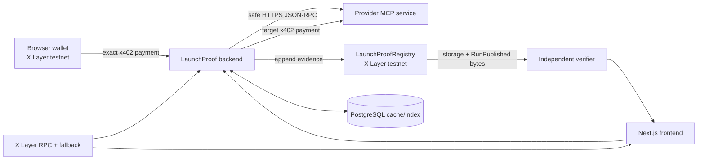

# LaunchProof — Complete Project and Implementation Guide

Last reviewed: 2026-07-17

This document explains what LaunchProof is, how every major part is implemented, what is genuinely on chain, how to reproduce and operate it on X Layer testnet, and the exact state of deployment readiness. The command-by-command operator runbook is [`setup.md`](../setup.md); this file is the architectural and implementation handoff.

## 1. Executive summary

LaunchProof is a testnet-only service rehearsal and evidence publication system for MCP tools. A provider publishes a signed Launch Contract describing a bounded, synthetic test. A buyer pays the fixed LaunchProof x402 fee. The backend discovers the MCP tool, runs a fixed sample, a controlled invalid input, and three fresh challenges, optionally pays for and verifies the provider's protected delivery, canonicalizes the retained evidence, and publishes the evidence and its hashes to an immutable X Layer registry.

The resulting Service Passport is independently checked from the chain, not merely trusted from PostgreSQL. A Passport is `verified` only when all five gates pass and both required x402 transfers are proven. The project does not fabricate transaction hashes, use a mock chain for public evidence, treat a database row as an on-chain proof, or infer a deployment address from a document.

The supported public profile is deliberately narrow:

| Item | Exact value |
|---|---|
| Chain | X Layer testnet |
| Chain ID | `1952` |
| CAIP-2 network | `eip155:1952` |
| Primary RPC | `https://testrpc.xlayer.tech/terigon` |
| Fallback RPC | `https://xlayertestrpc.okx.com/terigon` |
| Explorer | `https://www.okx.com/web3/explorer/xlayer-test` |
| Official test USD₮0 | `0x9e29b3aada05bf2d2c827af80bd28dc0b9b4fb0c` |
| Token decimals | `6` |
| OKX facilitator origin | `https://web3.okx.com` |
| Genesis LaunchProof fee | `10000` atomic USD₮0 = `0.01` |
| Renewal fee | `100000` atomic USD₮0 = `0.10` |
| Registry evidence limit | `65536` bytes |

Chain ID `195` is not used. Configuration, backend startup, deployment, fixture manifests, frontend payment checks, evidence validation, and the Solidity deploy script all require chain ID `1952`.

## 2. Current readiness and deployment truth

The application, schemas, fixtures, payment safety logic, registry contract, recovery paths, deployment recorders, and documentation are implemented and locally verified. A new registry must be deployed because the registry writer previously supplied to the project was exposed and the contract invariants changed.

Fresh role-separated testnet identities were generated into ignored mode-`0600` files. Only their public addresses are listed here:

| Role | Public address | Current test OKB at review time |
|---|---|---:|
| Deployer | `0xFfa92d000831E6E173c1757572862Cf43f2036a5` | `0` |
| Registry writer | `0x69d805Fe2c206fe0A5bd77C5e6191Ce74Fc17692` | `0` |
| Target payer | `0x64Eb80cba55927de8c613A95921bd6b5085bF18B` | `0` |
| Payment payout | `0x8A3d59DDB0E3cafCb2E1ddb8391EB903aafB94Dd` | not required for gas |
| Healthy fixture provider | `0x72533424FbC2a174a5745e0c440994997F1CD6d1` | not required |
| Invalid-output provider | `0x5dC4906FeF25939369B2849D734847C7A3Ec722f` | not required |
| Schema-drift provider | `0x08254c2980C69e32B713857eB893b847aB5A5CC8` | not required |
| Timeout provider | `0x8602b75409Ec40d5732C857c02A5Ee69f1938279` | not required |

The live read-only RPC check returned chain ID `1952`, confirmed bytecode at the official test USD₮0 address, and returned zero native balances for deployer, writer, and target payer. Therefore there is intentionally no claimed registry address, deployment transaction, deployment block, runtime bytecode hash, paid rehearsal, or publication transaction yet.

The former registry `0x222c757aE27e84480588DECB57929AC8be0f4bC4` is deprecated and untrusted for this release. Its historical records remain on chain, but its exposed writer and older four-gate status rules make it ineligible for LaunchProof verification. It is never used as a fallback.

The browser/demo payer is the user-controlled X Layer testnet account `0x995d174c8b0c4f70817eaa59adb8a3e20faf659c` (`XKO995d174c8b0c4f70817eaa59adb8a3e20faf659c`). Its private key is neither required nor stored by the application; the browser wallet approves its own test-token authorization.

The remaining launch gates are external, not unfinished application code:

1. Commit the reviewed working tree so `BUILD_COMMIT_SHA` identifies the exact source.
2. Rotate the OKX credentials that were previously shared and enter fresh test-capable credentials only in ignored `.env`.
3. Fund the fresh deployer and writer with test OKB; fund the target payer with the required test assets.
4. Deploy the four fixtures behind four real HTTPS origins.
5. Broadcast the new registry deployment and record its observed transaction/address/block/runtime hash.
6. Execute the browser x402 payment, target x402 payment, and evidence publication.

No code or documentation substitutes placeholder values for any of those facts.

## 3. System architecture



The frontend is a payment and verification client. The backend is the bounded rehearsal worker, x402 resource server, evidence generator, registry writer, and chain indexer. PostgreSQL provides durability and fast indexing but is not an authority. The Solidity registry is append-only and stores critical hashes while emitting the complete bounded canonical evidence. Four controlled fixtures demonstrate healthy, invalid-output, schema-drift, and timeout outcomes with separate provider identities.

## 4. Repository layout

| Path | Responsibility |
|---|---|
| `backend/src/rest` | REST routes, middleware composition, public schemas, health/status |
| `backend/src/mcp` | Strict MCP JSON-RPC client and public MCP facade |
| `backend/src/workers` | End-to-end rehearsal state machine and evidence production |
| `backend/src/payments` | Inbound LaunchProof x402 and outbound target x402 settlement |
| `backend/src/chain` | Startup preflight, registry publication, readback, index rebuild |
| `backend/src/evidence` | Sanitization, RFC 8785-style JCS, hashes, semantic verification |
| `backend/src/security` | SSRF-safe URL/DNS/request handling and response limits |
| `backend/src/db` | Memory and Prisma repositories, locks, recovery metadata |
| `backend/prisma` | PostgreSQL schema and committed migrations |
| `frontend/app`, `frontend/components` | Pages, payment UI, Passport/receipt/status/verification views |
| `frontend/lib` | Generated API client, registry ABI, browser chain verification |
| `contracts` | Registry source, Foundry deploy script, and contract tests |
| `fixtures/runtime` | Shared signed MCP/x402 fixture runtime |
| `fixtures/invoice-normalizer-*` | Four deterministic fixture packages |
| `schema` | Launch Contract, evidence, Passport, OpenAPI, and generated ABI |
| `scripts` | Key generation, deployment, recording, fixture tunnels, validation |
| `docs` | Architecture, threat model, fixtures, reproduction, campaign log |

## 5. The Launch Contract

A provider exposes a JSON document, normally at `/.well-known/launch-contract.json`. It declares:

- service and MCP endpoint identity;
- the exact tool name and bounded sample input;
- assertions for the known sample;
- the fresh-challenge input field and four output fields;
- latency and synthetic-read-only constraints;
- source revision as a 40-character Git commit;
- provider address and optional EIP-191 declaration signature;
- either `payment_mode=none` or exact x402 resource terms;
- the active CAIP-2 network, asset, amount, recipient, and resource URL.

Parsing is strict. Unknown top-level fields, unsupported assertion operators, unsafe URLs, excessive sizes, ambiguous schemas, wrong chain/token, zero addresses, contradictory safety claims, query strings, fragments, and embedded URL credentials fail closed.

The provider signs the SHA-256 hash of JCS canonical JSON after removing `declaration_signature`. A configured fixture must have the exact configured URL, exact configured provider address, `fixture=true`, current committed source revision, and a valid signature. A caller-controlled `fixture` field alone never grants fixture status.

The safety declaration is a testable scope declaration, not marketing language. The controlled fixtures declare that the tool reads only synthetic sample data, needs no account/credentials, and has no tool side effect beyond the explicitly declared x402 payment. Contradictory claims are rejected.

## 6. Rehearsal pipeline

The worker performs these bounded stages:

1. **Reserve** — create a random 32-byte run ID and durably bind it to the idempotency key, target, operation, and renewal lineage.
2. **Fetch contract** — normalize the manifest URL, apply SSRF policy, limit redirects/body/time, parse strict JSON, and verify provider declaration.
3. **Discover MCP** — require JSON-RPC 2.0, the supported MCP protocol `2025-06-18`, declared tools capability, a unique tool name, and a closed bounded input schema.
4. **Fixed sample** — execute the provider-declared synthetic sample and compare declared assertions.
5. **Invalid input** — remove a required field and require a bounded structured `TOOL_ERROR` without output, timeout, stack trace, or secret-like data.
6. **Fresh challenges** — generate three new bounded synthetic invoices and compare exactly four normalized fields for each.
7. **Paid delivery** — for `x402_optional`, pay the exact allowlisted provider resource and verify its returned `run_id` and `source_revision`.
8. **Canonicalize** — sanitize retained fields, compute timings/gates/remediation, construct JCS, and derive hashes.
9. **Publish** — submit the immutable record and canonical bytes, wait for confirmations, read storage/event back, and verify everything again.
10. **Index** — save the finalized record and payment references for fast reads.

The complete rehearsal has a 30-second deadline, each call has bounded latency, response bodies and evidence fields are limited, and concurrency/payment limits are configured centrally.

## 7. Gates and status calculation

| Gate | Pass condition |
|---|---|
| `discoverable` | Supported MCP protocol and tools capability; declared tool's real bounded schema accepts both sample and challenge input |
| `contract_correct` | Fixed sample assertions pass and controlled invalid input produces the safe structured failure |
| `fresh_challenge` | All three fresh challenges return four matching fields without classification errors |
| `safe_to_rehearse` | Discovery passes, invalid input is safely rejected, and the strict synthetic/read-only claims are valid |
| `paid_delivery` | Exact target x402 settlement and exact delivery payload both verify; `not_tested` only for `payment_mode=none` |

Each gate uses two bits: `0=not_tested`, `1=pass`, `2=fail`; value `3` and all high bits are invalid.

- `verified`: all five gates pass.
- `needs-attention`: the first four were tested and at least one failed, or paid delivery did not pass.
- `not-rehearsable`: infrastructure prevented complete core testing.

The backend calculates this mapping, the independent evidence validator recalculates it, and Solidity enforces it. A local-only or unpaid run cannot become `verified`.

## 8. Payments and real transfer proof

### 8.1 Inbound LaunchProof payment

Protected REST and MCP rehearsal routes use the official OKX x402 server packages. The challenge fixes the network, official token, atomic amount, recipient, and route. The body `idempotency_key` must exactly equal the HTTP header. The verified payer is subject to an hourly limit and the global daily capacity is claimed before settlement.

After facilitator settlement, LaunchProof requires:

- successful final facilitator status;
- exact `eip155:1952` network;
- exact scheme, token, amount, route, and configured payout;
- a valid payer and transaction hash;
- a successful X Layer receipt with an exact ERC-20 `Transfer(from,to,value)`;
- the receipt block timestamp as the payment timestamp;
- two confirmations before ordinary authorization.

Genesis and renewal use different exact prices and routes. Payment transaction hashes are unique globally, and each run can have only one payment of each kind.

### 8.2 Outbound target payment

The backend pays only an allowlisted public hostname, only the manifest's exact resource, and only when the declared network/asset/amount/recipient fit the configured per-run and daily caps. The target payer is a separate wallet. Its transfer receipt and block timestamp are verified independently. The target response is reduced to the expected `run_id` and `source_revision`; arbitrary paid response data is not retained.

The application enforces one backend replica because target-payment budget serialization is process-local around the database critical section. Before the signed EIP-3009 authorization can be sent, the exact public x402 payload, nonce, payer, recipient, amount, validity bound, and starting block are stored in the run record. Startup locates `AuthorizationUsed` by that indexed payer/nonce, requires the matching transfer in the same receipt, and saves the real settlement. It never creates a replacement while the authorization is live or chain outcome is unknown; an unused authorization can be cleared and retried only after expiry.

### 8.3 Browser safeguards

Before signing, the frontend checks the challenge's chain, official USD₮0 contract, decimals, amount, recipient, and route. It persists the idempotency key/run binding in local storage and polls the same run after refresh or retry. Public environment variables contain only public anchors.

## 9. Crash safety and idempotency

The paid state machine is:

```text
payment_required
  -> settlement_claimed
  -> payment_ambiguous (transaction returned; chain outcome pending)
  -> payment_settled
  -> queued -> ... -> publishing_on_chain -> complete
```

- `settlement_claimed` is a five-minute durable capacity lease created after verification and before settlement.
- As soon as the facilitator returns a valid result, the exact transaction hash, payer, amount, and route are stored before receipt waiting.
- Startup authorizes only that exact candidate if the exact transfer succeeds.
- A confirmed revert resets the run to `payment_required`.
- Missing, pending, dropped, or RPC-indeterminate results stay `payment_ambiguous`; the backend will not attempt another charge.
- Pre-target worker stages with a saved payment are recoverable after restart.
- Target-payment authorization is persisted before it leaves the backend; startup reconciles its indexed nonce and transfer before resuming the run.

Registry publication has the same conservative design. The backend prepares and signs the transaction locally, derives its actual hash, persists that hash and the exact canonical candidate, rechecks RPC chain ID `1952`, and only then sends the raw transaction. Startup finalizes an exact successful record, does nothing while outcome is unknown, and retries the identical evidence only after a confirmed revert. A finalized run cannot be overwritten with different canonical evidence.

## 10. Evidence, hashes, and privacy

The canonical evidence includes manifest, bounded discovery facts and discovered input schema, invocations, comparisons, paid-delivery evidence, timings, gates, provider declaration, payment references, source/build revisions, remediation, and explicit limitations.

Hash construction is deterministic:

| Hash | Material | Algorithm |
|---|---|---|
| `manifest_hash` | JCS of signing body without declaration signature | SHA-256 |
| `input_hash` | JCS of retained fixed/invalid/challenge/paid-delivery inputs | SHA-256 |
| `normalized_result_hash` | JCS of normalized comparisons | SHA-256 |
| `evidence_hash` | exact JCS canonical evidence string | SHA-256 |
| `sourceRevisionHash` | source Git SHA string | SHA-256 |
| `paymentReceiptHash` | normalized LaunchProof payment reference | SHA-256 |
| runtime code hash | deployed registry runtime bytecode | Keccak-256 |

Run IDs use cryptographically random 32-byte values. Deployment addresses, block numbers, transaction hashes, and runtime hashes are observed from receipts and RPC calls by the recording helper. `BUILD_COMMIT_SHA` must match a clean checked-out commit. Fixture `source_revision` must match that same committed source. None of these provenance values is generated from a placeholder.

Before immutable publication, evidence sanitization:

- retains only declared output fields;
- strips raw HTTP headers/bodies and credentials;
- redacts secret-like keys, bearer values, JWTs, and private-key-shaped error text;
- caps string length, keys, arrays, object depth, invocations, comparisons, latency, and total evidence bytes;
- retains only bounded server identity/schema facts and structured errors.

Users must still submit synthetic/public inputs only. On-chain event bytes are permanent.

## 11. Solidity registry

`LaunchProofRegistry` has one immutable nonzero writer and write-once `bytes32` run IDs. It stores critical hashes, source/payment linkage, renewal lineage, provider, writer/timestamp anchors, gate bitmap, status, signature state, and fixture state. `RunPublished` emits the same record plus the exact canonical evidence bytes.

The contract rejects:

- unauthorized writers or duplicate/zero run IDs;
- zero critical hashes/provider;
- caller-supplied writer/timestamp anchor metadata;
- evidence above 65,536 bytes or a SHA-256 mismatch;
- invalid gate bits or a gate/status contradiction;
- malformed, high-`s`, wrong-signer, or falsely claimed signatures;
- a fixture or `verified` Passport without a real provider signature.

The registry is an immutable single-writer attestation log, not a decentralized oracle. HTTP/MCP correctness is measured off chain and made auditable on chain.

## 12. Independent verification

`GET /verify/:runId` does not simply compare a cached hash. It reads registry storage and the `RunPublished` log, reconstructs canonical JSON, then verifies:

- exact canonical bytes and SHA-256 evidence hash;
- manifest, input, and normalized-result hashes;
- provider declaration signature and fixture/Verified signature requirements;
- gate bitmap/status and all linkage fields;
- event/storage equality and immutable anchors;
- strict evidence structure and public URL/origin rules;
- manifest/source/provider/payment/gate/timing/invocation semantics;
- discovered protocol, tools capability, input schema hash, and actual schema acceptance;
- exact launch and target ERC-20 transfers, payer/recipient/value, transaction ordering, and block timestamps;
- live registry runtime bytecode against the recorded Keccak-256 runtime hash;
- optional PostgreSQL cache equality.

The response exposes separate booleans including `evidence_semantics_match`, `launch_payment_transfer_match`, `target_payment_transfer_match`, and `registry_runtime_match`. A cache hit uses its known publication receipt; an unknown run uses storage plus a binary search for the immutable anchored timestamp and one bounded indexed-log query, not a deployment-to-head scan. Public Passport reads return only records whose complete chain verification matches.

The browser also performs direct RPC verification using the bundled ABI. `scripts/verify-run.sh` requires testnet execution, all five passing gates, both settled payments, a publication transaction, and every server-side chain check.

## 13. PostgreSQL model

- `Run`: durable reservation/state, canonical record, hashes, lineage, chain link, capacity lease, signed target-payment recovery candidate, and publication recovery metadata.
- `Invocation`: fixed/invalid/challenge observations and comparisons.
- `Payment`: one immutable launch and one immutable target reference per run; unique settlement transaction.
- `Provider`: latest manifest/signature verification for an address.
- `ChainCursor`: reorg-overlapped registry indexing cursor.
- `Fixture` and `CampaignLog`: explicit operational metadata.

Advisory transaction locks serialize inbound capacity/payment authorization and publication updates. Startup rebuilds the cache from verified chain logs with a 12-block overlap. PostgreSQL can accelerate or recover the service but cannot make a chain verification pass.

## 14. HTTP, MCP, and frontend surfaces

Important HTTP routes:

| Route | Purpose |
|---|---|
| `POST /api/rehearsals` | Paid Genesis rehearsal |
| `POST /api/renewals` | Paid renewal linked to a previous run |
| `POST /mcp/rehearse`, `/mcp/renew` | Paid MCP equivalents |
| `POST /mcp/public` | Free MCP discovery/read operations |
| `GET /runs`, `/runs/:runId` | Verified chain-derived Passports/progress |
| `GET /verify/:runId` | Full independent chain verification |
| `GET /receipts/:paymentId` | Payment/run linkage |
| `GET /fixtures`, `/status`, `/healthz` | Public catalog and readiness |
| `GET /schema/*` | OpenAPI, Launch Contract schema, and registry ABI |

The Next.js UI includes home, rehearsal/payment, fixture catalog, Passport, receipt, comparison, status, quick verification, and direct chain verification pages. It never receives backend, provider, payer, deployer, payout-custody, or OKX secrets.

## 15. Fixtures

All four variants share the real MCP/x402 runtime and invoice-normalization contract but intentionally produce different outcomes:

| Fixture | Behavior | Payment mode |
|---|---|---|
| healthy | Correct fixed/challenge output and protected delivery | `x402_optional` |
| invalid-output | Incorrect values with valid shape | `none` |
| schema-drift | Output contract no longer matches | `none` |
| timeout | Exceeds bounded latency | `none` |

Each public fixture has its own HTTPS origin and private provider key. Its manifest signs its actual source revision, URL, provider identity, network, token, and payment terms. Tunnel scripts start services only after real public URLs exist and verify the exact public signed manifests before updating `.env`.

## 16. Security controls

- Testnet-only startup and deploy guards; mainnet opt-in remains disabled.
- Exact official token and decimals; no arbitrary asset supplied by the browser/provider.
- Separate deployer, writer, target payer, payout custody, and four provider identities.
- Secrets only in ignored mode-`0600` files; deployer and payout keys segregated from application env.
- Strict CORS, JSON size, free challenge, paid payer, global daily, concurrency, payment amount, and daily spend limits.
- SSRF defense with URL normalization, public DNS resolution, IP-range rejection, redirect revalidation, allowlist policy, timeouts, and body caps.
- Strict MCP JSON-RPC IDs/types, content types, session handling, capabilities, tool counts, schemas, and output shapes.
- Sanitized errors/logs/evidence; no credentials or raw target payloads in structured logs.
- Clean committed source required for public fixture launch and deployment.
- Deployment transaction input, sender, creation bytecode, source hash, deployment boundary, live code, runtime hash, writer, and evidence limit are checked read-only.
- Docker ignores every environment/key file and PostgreSQL is loopback-only in Compose.

Previously disclosed credentials must remain revoked. The current tree contains no usable committed credential, but an exposed private key also existed in earlier Git history. Removing it from the latest tree does not erase history; coordinate a repository history rewrite and invalidate old clones if that repository is public.

## 17. Reproducible setup and deployment

### 17.1 Selective deployment-branch audit

Commit `dcf5ca7617d0aba7c820a628292559836b56600f` was inspected as a reference and was not merged. The safe concepts retained are the monorepo frontend build on Vercel, Prisma-backed PostgreSQL, and independently packaged fixtures. `vercel.json` was rewritten as a frontend-only build using the pinned lockfile; no source file or environment file from that branch was copied verbatim.

The following reference-branch designs were explicitly excluded: the Vercel Functions backend and root API wrapper, backend/index reconstruction skips, committed `.env` files, `NODE_ENV=development`, permissive wildcard CORS and local-run header exposure, chain ID `195`, mainnet evidence defaults, the former registry/writer, hardcoded fixture catalog URLs, development fixture identities, and serverless fixture cold-start behavior. The persistent backend remains a single container process with startup recovery and PostgreSQL; fixture URLs and identities remain deployment environment values.

### 17.2 Build and deploy sequence

Use Node 24 and pnpm `10.13.1`. The concise sequence is below; [`setup.md`](../setup.md) contains the detailed checks and troubleshooting.

```bash
git clone https://github.com/Kevincruz2005/LaunchProof.git
cd LaunchProof
corepack enable
corepack prepare pnpm@10.13.1 --activate
pnpm install --frozen-lockfile
pnpm --filter @launchproof/backend exec prisma generate
pnpm check

cp .env.example .env
chmod 600 .env
pnpm keys:testnet
# Commit the reviewed source, then record that exact commit:
node scripts/update-env.mjs .env BUILD_COMMIT_SHA "$(git rev-parse HEAD)"
```

Fund the public roles with testnet assets, then deploy and record the real registry:

```bash
pnpm registry:deploy-testnet
DEPLOY_TX="$(jq -r '.transactions[] | select(.transactionType == "CREATE") | .hash' \
  contracts/broadcast/Deploy.s.sol/1952/run-latest.json | tail -n 1)"
pnpm registry:record-testnet -- "$DEPLOY_TX"
```

Configure fresh OKX credentials in ignored `.env`, start PostgreSQL/migrations, and expose all four fixtures:

```bash
docker compose up -d postgres
node --env-file=.env backend/node_modules/prisma/build/index.js migrate deploy \
  --schema backend/prisma/schema.prisma
bash scripts/start-fixtures-ngrok.sh
node scripts/validate-demo-env.mjs
./scripts/demo.sh
```

Then use the healthy fixture from `http://localhost:3000/rehearse`, approve only the exact testnet challenge, and verify the completed run:

```bash
RUN_ID=0xYOUR_REAL_32_BYTE_RUN_ID
curl -fsS "http://localhost:4000/runs/$RUN_ID" | jq .
curl -fsS "http://localhost:4000/verify/$RUN_ID" | jq .
./scripts/verify-run.sh "$RUN_ID"
```

A genuine verified run shows three real transaction references: the inbound LaunchProof transfer, outbound protected-delivery transfer, and registry publication.

## 18. Local development mode

Local fixtures can run on `127.0.0.1:4101` through `:4104` with explicit developer flags:

```bash
node scripts/update-env.mjs .env \
  ALLOW_PRIVATE_TARGETS true \
  ALLOW_LOCAL_UNPAID_RUNS true \
  X402_ENABLED false \
  FIXTURE_X402_ENABLED false
pnpm fixtures:local
pnpm dev
```

Local mode is useful for UI and rehearsal development. It produces `execution_mode=local`, `local_only` payment status, and an unpublished/zero chain reference. It is never accepted by the public verification helper as a verified Passport. Reset both escape hatches to `false` before public operation.

## 19. Verification completed for this implementation

The following checks passed on the reviewed working tree:

| Check | Result |
|---|---|
| Backend Vitest | 12 files, 74 tests passed |
| Frontend Vitest | 1 file, 3 tests passed |
| Fixture runtime Vitest | 1 file, 7 tests passed |
| Solidity Foundry | 9 tests passed, 0 failed |
| Backend TypeScript | passed |
| Frontend TypeScript | passed |
| Fixture runtime TypeScript | passed |
| Backend production build | passed |
| Fixture runtime build | passed |
| Next.js production build | passed; 9 routes generated/compiled |
| Solidity compile/ABI refresh | passed; creation bytecode `3184` bytes |
| `forge fmt --check` | passed |
| JSON syntax and shell/Node script syntax | passed |
| Strict Ajv compile for evidence/Passport/Launch Contract schemas | passed |
| `git diff --check` | passed |
| pnpm frozen lockfile, offline | up to date with pnpm `10.13.1` |
| Prisma client generation | passed |
| Live RPC identity | chain `1952`; official test USD₮0 code present |

Docker is not installed in the review host, so `docker compose config` and a live PostgreSQL migration/container smoke test were not run there. Prisma generation, repository tests, committed migrations, and all TypeScript/build checks passed. The public end-to-end transaction test is pending the external funding/credential/HTTPS gates described in section 2.

## 20. Operational checklist

Before every public demo or release:

- clean committed tree and exact `BUILD_COMMIT_SHA`;
- fresh non-disclosed keys and OKX credentials;
- mode `0600` secrets; payout custody backed up separately;
- chain ID/network/RPC/token/browser values exact and consistent;
- newly recorded registry address/block/runtime hash and writer;
- writer and target payer funded with test OKB; payer/browser funded with official test USD₮0;
- four distinct HTTPS fixture origins, keys, signatures, URLs, and allowlist entries;
- both local development escape hatches false;
- PostgreSQL migrations applied and one backend replica;
- `pnpm check`, Foundry tests, and `validate-demo-env.mjs` pass;
- wallet challenge visually matches network/token/amount/payout;
- final `/verify` has every required match flag true;
- explorer links resolve to the real settlement/publication transactions.

Monitor ambiguous payments/publications rather than manually retrying them. Rotate a compromised immutable writer by deploying a new registry. Never edit deployment metadata to make validation pass.

## 21. Scope and limitations

LaunchProof is a point-in-time bounded rehearsal. It is not a security audit, certification, uptime guarantee, marketplace identity check, mainnet settlement system, decentralized oracle, or OKX endorsement. Provider HTTPS/MCP execution is off chain. The registry proves what the configured writer observed and makes the exact evidence immutable; it cannot prove all future behavior of the service.

The implemented scope is `structured-extraction-v1`: a closed bounded MCP input schema, fixed assertion profile, controlled invalid input, three fresh invoice challenges, and optional paid delivery. Extending to arbitrary agents, side-effecting tools, mainnet, multiple writers, or decentralized attestation requires a new threat model and contract/profile version, not just an environment change.
